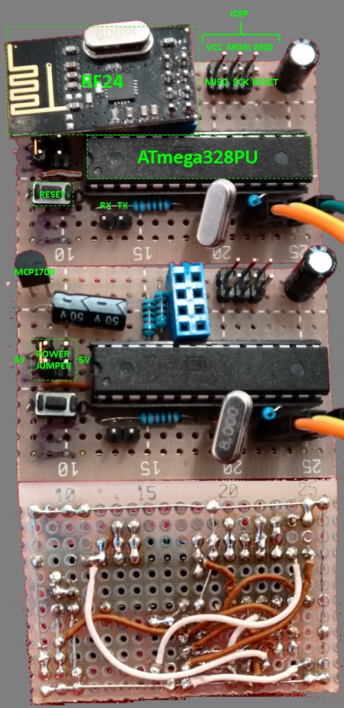

# Weatherbug

A project to log temperature and relative humidity from battery powered sensor devices via radio.

## Overview

There are two parts to this project, a [Raspberry Pi](https://www.raspberrypi.org/) (RPI) which listens for sensor data and one or multiple sensor devices (henceforth simply called sensor or device).

The devices periodically send their sensor readings to the RPI by means of Nordic's [nRF24L01+](http://www.nordicsemi.com/eng/Products/2.4GHz-RF/nRF24L01) 2.4GHz radio (abbrev. to RF24 hereafter). Upon reception the sensor data is logged to file on the RPI.

### Mode of Operation

When a sensor device is first powered up it monitors the radio for a clock source. A clock source can be either the RPI which provides the master clock or another, properly synced, sensor device.

Once the device detects the clock it goes to sleep until the next _send_ interval. When the time comes the device is wakes up, takes an enviromental reading, and transmits the result to the RPI. At the end of this short _send period_ the sensor goes back to sleep.


### Network Topology

The sensor devices and the RPI form a mesh network. Routing in the network is done using the [B.A.T.M.A.N. protocol](https://tools.ietf.org/html/draft-wunderlich-openmesh-manet-routing-00). Sensor data is sent using a stripped down version of [TCP](https://tools.ietf.org/html/rfc793).


### Power supply and power consumption

Given the sensor device is designed to run on batteries it has to be operated on D.C. current with a max. input voltage of 6V. I have seen the device work correctly with input voltages as low as 3.5V.

Typical power consumption is around 25uA when the device is asleep and 15mA when active.

Under optimal conditions, the sensor can function on the battery for more than a year. However, failure to sync the device clock to the master clock cause it to enter a power consuming monitoring state. If this state persists AAA batteries are typically drained within days.


## Hardware



You will need to build the sensor devices. The parts are approx. EUR 10 per device. The circuit diagram is [here](doc/Weatherbug r1.2.fzz). I used the free and very nice [Frizzing](http://fritzing.org/) tool for the layout.

You'll also need to solder a capacitor to an RF24 radio chip and connect it to the RPI. Otherwise the radio will most likely not work due to power fluctuations. I use a 1uF capacitor which seems to do the trick.


Other than the device parts and some soldering skills you will need

* An avrdude compatible AVR programmer like [usbasp](http://www.fischl.de/usbasp/)
* a serial/COM port or an USB to serial adaptor to connect to the device UART
* a terminal program to communicate over the serial connection (I use picocom)


## Software

To build the device firmware you will need

* an Atmel (AVR) toolchain (libc, gcc, binutils) to build the firmware
* avrdude to upload the device firmware
* cmake 3.0 or better

If your are on Debian Linux

```
$ sudo apt-get install avrdude avr-libc gcc-avr binutils-avr
```

should get you set up.

### Building the device software

Get the sources, then run `cmake` on `src/avr/weatherbug` to configure the build environment. Next, run `make` (or whatever tool the cmake generated build instructions for) to build the firmware. Once the firmware image has been built, you can upload it to the device using `make flash_1.2` (assuming you use an usbasp compatible AVR programmer). Otherwise you will need to call `avrdude` with the right parameters for your device.


### Building the RPI software

Run `cmake` on `src/rpi` to set up the build, then run `make` followed by  `sudo DESTDIR=/path/to/install/to make install` to install the binaries

## Configuring the sensor device

Connect a power source to the device and hook up your serial cables. Make sure to connect the mass pin of the serial cable to the mass pin of the device, else you run danger of having a floating potential which might kill the device.

Also note that the serial communication will exhibit seemingly strange behavior or will simply cease to function if the cables are too long. I have worked with up to 30 cm, but as usual your mileage may vary.

The device is configured to 38400 baud with 8 data bits, 1 stop bit and no parity (8N1). Initiate a connection to the device using your favorite terminal program, e.g.

```
$ picocom -c -b 38400 --imap lfcrlf /dev/ttyUSB0
```

Once connected, hit the reset button. You should see the device greeting in the terminal program

```
Hello there!
This is Weatherbug version .....
```

### Service mode

During the first 10 seconds after power on or reset, the device is in bootstrap mode and will accept commands via the terminal. Type `?`+ENTER (the ? character followed by the ENTER key) to see a list of commands. Switch the device to service mode by typing `!serv`+ENTER.

Once in service mode you can configure the device using the various `!` commands. Type `?`+ENTER to see what's available.

Most settings are applied immediately and are not persisted so you can play around with them to try things out. If you muck up, simply reset the device and it will be back to its original configuration. To save your changes type `!cfst`+ENTER at the prompt.

When you are finished, type `!dflt`+ENTER to return to default mode.

#### Configuration caveats

1. The RF24 setup must be the _same_ for all devices _and_ the RPI in order to communicate via radio. Specifically
 * radio channel (defaults to 76)
 * CRC selection (defaults to 16 bit)
 * data rate (defaults to 2MBit)

 must be identical.

1. The payload size must be set to 32 bytes and the CRC to 16 bit on the RPI. These are the default settings for `rf24-packet-router` so everything _should_ work out of the box.

1. Each device as well as the RPI must have a _unique_ network id.

1. The network id `0xff` is reserved as the broadcast address.

## Start the monitoring software on the RPI

Start the packet router that will listen on the RF24 device

```
$ sudo rf24-packet-router --sleep 100 &
```

Then start the network which will handle the master clock generation, routing, and TCP.

```
$ rf24-network -i <network id> &
```

And finally start

```
$ rf24-tcp | tee sensor.log
```

to dump TCP messages to console and file.


## Troubleshooting

Let's face it. Things don't always work perfectly. For radio related issues there are two helper programs available to track down communication issues.

`rf24-ping` continously sends ping messages to the broadcast address.
`rf24-echo` prints whatever it receives to stdout/USART0.

## License

This software and documentation is available under the [MIT license](https://opensource.org/licenses/MIT)
